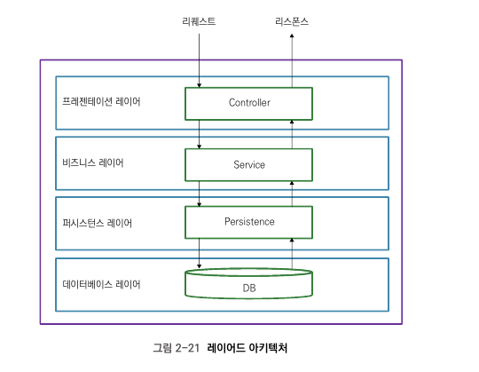

# 2.2 백엔드 서비스 아키텍처
## 2.2.1 레이어드 아키텍처

* 레이어드 아키텍처(Layered Architecture) 패턴
  * 애플리케이션을 구성하는 요소들을 수평으로 나눠 관리하는 것
  * 레이어의 특징
    * 레이어로 나눈다는 것의 의미
      * 메서드를 클래스 또는 인터페이스로 쪼개는 것
      * 이 레이어는 작게는 클래스를 여러 레이어로 나누는 것부터, 아주 다른 애플리케이션으로 레이어를 분리하는 경우까지 범위가 다양함
    * 레이어 사이에는 계층이 있음
      * 기본적인 레이어드 아키텍처에서는 상위 레이어가 자신의 바로 하위 레이어를 사용함
## 2.2.2 모델, 엔티티, DTO
  * 보통 자바로 된 비즈니스 애플리케이션의 클래스는 두 가지 종류로 구분됨
    1) 일을 하는 클래스(기능을 수행하는 클래스)
       * **컨트롤러, 서비스, 퍼시스턴스**처럼 로직 수행
    2) 데이터를 담는 클래스
        * **엔티티, 모델, DTO**처럼 아무 기능 없이 DB에서 반환된 비즈니스 데이터를 담음
### 모델과 엔티티
#### 모델
  * 비즈니스 데이터를 담는 역할과 DB의 테이블과 스키마를 표현하는 두 역할을 함
  * 큰 애플리케이션의 경우 모델과 엔티티를 따로 구현하기도 함
  * 모델/엔티티에서 사용하는 어노테이션
    * **@Builder**
      * Builder는 오브젝트 생성을 위한 디자인 패턴(Refactoring Guru) 중 하나임
      * 롬북이 제공하는 @Builder 사용시 Builder 클래스를 따로 개발하지 않고도 Builder 패턴 사용해 오브젝트 생성 가능
      * 생성자를 이용해 오브젝트를 생성하는것과 비슷하지만, 생성자의 매개변수 순서를 기억하지 않아도 된다는 점이 더 편리함
        ```Java
        //롬북이 생성하는 Builder 메서드 사용법 예시
        TodoEntity todo = TodoEntity.builder().id().userId().title().build();
    * **@NoArgsConstructor**
      * 매개변수가 없는 생성자를 구현해 줌
         ```Java
        //롬북이 생성하는 NoArgsConstructor
        public TodoEntity() {}
    * **@AllArgsConstructor**
      * 클래스의 모든 멤버 변수를 매개변수로 받는 생성자를 구현해 줌
        ```Java
        //롬북이 생성하는 AllArgsConstructor
        public TodoEntity(String id, String userId, String title, boolean done) {
            super();
            this.id = id;
            this.userId = userId;
            this.title = title;
            this.done = done;
        }
    * **@Data**
      * 클래스 멤버변수의 Getter/Setter/toString 등을 구현해 줌

#### DTO
* 서비스가 요청을 처리하고 클라이언트가 반환할 때 모델Model 자체를 그대로 리턴하는 경우는 별로 없음.
* 보통은 데이터를 전달하는데 사용하는 오브젝트인 DTO(Data Transfer Object)로 변환해 리턴함
  * 그냥 모델을 리턴하지 않고 DTO로 변환해 리턴해주는 이유
    1. 비즈니스 로직을 캡슐화encapsulation하기 위해
       * 모델은 DB의 테이블 구조와 매우 유사함
         * 모델이 갖고 있는 필드는 테이블의 스키마와 비슷할 확률이 매우 높음
       * 대부분의 비즈니스는 외부인이 자사의 데이터베이스 스키마와를 아는 것을 원치 않음
       * 따라서 DTO처럼 다른 오브젝트로 바꿔 변환하면 외부 사용자에게 서비스 내부의 로직, DB의 구조 등을 숨길 수 있음
    2. 클라이언트가 필요한 정보를 모델이 전부 포함하지 않는 경우가 많기 때문
       * 대표적인 예) 에러 메세지
         * 만일 서비스 실행 중 사용자 에러가 나면 이 에러 메시지를 어디에 포함될 것인가? 모델은 서비스 로직과 관련이 없으므로 모델에 담기는 애매함. 이런 경우 DTO에 에러 메세지 필드를 선언해 DTO에 포함시키면 됨.

## 2.2.3 REST API
* 아키텍처 스타일은 아키텍처 패턴의 차이
  * 아키텍처 패턴
    * 어떤 반복되는 문제상황을 해결하는 도구
  * 아키텍처 스타일
    * 반복되는 아키텍처 디자인
* REST와 HTTP의 엄밀한 구분
  * REST
    * HTTP를 이용해 구현하기 쉬운 아키텍처 스타일
  * HTTP
    * REST 아키텍처를 구현할 때 사용하면 쉬운 프로토콜
### REST(Representational State Transfer) API Tutorial
  * 아래의 6가지 제약조건으로 구성된 아키텍처 스타일(RESTful API)
    * 클라이언트-서버 Client-Server
    * 상태가 없는 Stateless
    * 캐시되는 데이터 Cacheable data
    * 일관적인 인터페이스 Uniform Interface
    * 레이어 시스템 Layered System
    * 코드-온-디맨드(선택사항) Code-On-Demand

#### 클라이언트-서버 Client-Server
* 의미
  * 리소스를 관리하는 서버가 존재하고 다수의 클라이언트가 리소스를 소비하려고 네트워크를 통해 서버에 접근하는 구조
    * 리소스: REST API가 리턴할 수 있는 모든 것을 의미함
      * 예) HTML, JSON, 이미지 등
  * 웹 애플리케이션도 클라이언트(브라우저)-서버 구조임 
  
#### 상태가 없는 Stateless
* 의미
  * 클라이언트가 서버에 요청을 보낼 때 이전 요청의 영향을 받지 않음
    * 예) /login으로 로그인 요청을 보내고 로그인이 돼 다음 페이지인 /page로 넘어간 상황
      * /page로 리소스를 불러올 때 이전 요청에서 로그인한 사실을 서버가 알고있다면 그것은 상태가 있는 stateful 아키텍처임
      * 서버가 그 사실을 알지 못할 때 상태가 없다stateless고 함
      * 서버는 로그인 상태를 유지하지 못하므로 클라이언트 쪽에서 요청을 보낼 때마다 로그인 정보를 항상 함께 보내야 함
  * 클라이언트는 서버에 요청을 할 때마다 요청에 리소스를 받기 위한 모든 정보를 포함해야 함
  * 리소스를 수정한 후 상태를 유지해야 하는 경우 서버가 아닌 db같은 퍼시스턴스 상태를 저장해야 함
  * HTTP는 기본적으로 상태가 없는 프로토콜임 --> HTTP를 사용하는 웹 애플리케이션은 기본적으로 stateless

#### 캐시되는 데이터 Cacheable data
* 서버에서 리소스를 리턴할 때 캐시가 가능한지 아닌지 명시해야 함
* HTTP에서는 cache-control이라는 헤더에 리소스의 캐시 여부를 명시할 수 있음

#### 일관적인 인터페이스 Uniform Interface
* 의미
  * 시스템 또는 애플리케이션의 리소스에 접근할 때 인터페이스가 일관적이어야 함
    * 예) Todo 아이템을 가져오기 위해 http://fsoftwareengineer.com/todo를 사용한 상황
      * 이 때 Todo 아이템을 업데이트하는 데 http://fsoftwareengineer2.com/todo를 사용해야 한다면 일관적인 인터페이스가 아님 
      * --> URI의 일관성이 깨졌음
    * 예) http://fsoftwareengineer.com/todo가 JSON 형식의 리소스를 리턴하는 상황
      * 이 때 http://fsoftwareengineer.com/account가 HTML을 리턴한다면 일관적인 인터페이스가 아님 
      * --> 리턴 타입의 일관성이 깨졌음
  * 리소스에 접근하는 방식, 요청 형식, 응답 형식, URI, 요청의 형태와 응답의 형태가 애플리케이션 전반에 걸쳐 일관적이어야 함
  * 서버가 리턴하는 응답에는 해당 리소스를 수정할 수 있는 충분한 정보가 있어야 함
    * 예) Todo아이템을 받아왔는데 ID가 없다면 이후 클라이언트는 Todo아이템을 업데이트 하거나 삭제 불가
      * --> 리소스를 수정하는 데 충분한 정보가 부족한 것

#### 레이어 시스템 Layered System
* 클라이언트가 서버에 요청을 할 때 여러 개의 레이어로 된 서버를 거칠 수 있음
  * 예) 서버가 인증 서버, 캐싱 서버, 로드 밸런서를 거쳐 최종적으로 애플리케이션에 도착하는 상황
    * 이 사이의 레이어들은 요청과 응답에 영향을 미치지 않으며, 클라이언트는 서버의 레이어 존재 유무를 알지 못함

#### 코드-온-디맨드 Code-On-Demand <선택사항>
* 클라이언트는 서버에 코드를 요청할 수 있고 서버가 리턴한 코드를 실행할 수 있음

## 2.2.4 컨트롤러 레이어: 스프링 REST API 컨트롤러
## 2.2.5 서비스 레이어: 비즈니스 로직
## 2.2.6 퍼시스턴스 레이어: 스프링 데이터 JPA
## 2.2.7 정리